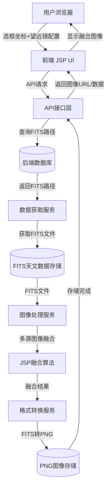

# Astro Viewer - JSP UI

这是 Astro Visualizer 项目的前端子项目，基于 React、TypeScript 和 Vite 构建，旨在提供天文数据的可视化界面。

## 目录结构

```
apps/jsp-ui/
├── public/                # 静态资源
├── src/                   # 源代码
│   ├── components/        # 通用组件
│   ├── constants/         # 常量定义
│   ├── data/              # 示例数据
│   ├── hooks/             # 自定义 hooks
│   ├── routes/            # 路由配置
│   ├── services/          # 数据服务
│   ├── theme/             # 主题相关
│   ├── types/             # 类型定义
│   ├── utils/             # 工具函数
│   └── views/             # 页面视图
├── index.html             # 入口 HTML
├── package.json           # 项目依赖与脚本
├── tsconfig.json          # TypeScript 配置
├── vite.config.ts         # Vite 配置
└── ...
```

## 快速开始

请安装 pnpm@v8.15.4
安装 `npm install -g pnpm`

1. **安装依赖**

```bash
pnpm install
```

2. **启动开发服务器**

```bash
pnpm run dev
```

3. **访问应用**

打开浏览器访问 [http://localhost:5173](http://localhost:5173)（端口号以实际输出为准）。

## 主要依赖

- React
- TypeScript
- Vite
- Three.js（用于三维可视化）

## 项目脚本

- `npm run dev` 启动开发服务器
- `npm run build` 打包生产环境代码
- `npm run preview` 预览打包后的应用

## 系统架构图



> 上图展示了 Astro Visualizer 的主要架构：用户通过浏览器访问前端（JSP UI），前端通过 API 与后端服务通信，后端负责数据处理与存储。

## 核心业务流程

1. 用户在前端 3D 天区球体界面中，通过鼠标框选或点击选区，选择感兴趣的天区区域。
2. 前端将用户选区的坐标（如多边形顶点）、所选望远镜、滤镜/波段等信息，打包成请求参数，发送给后端。
3. 后端根据参数，自动到对应的数据库查找相关天文数据，下载相应的 FITS 天文图像。
4. 后端通过 Joint Survey Processing（JSP）算法对多源图像进行融合处理。
5. 融合后的图像被转化为 PNG 格式，并返回给前端。
6. 前端接收 PNG 图像并进行可视化展示，支持缩放、交互等操作。

> 该流程实现了多望远镜、多波段天文数据的联合可视化与分析。

## 相关文档

- `docs/WCS_UPGRADE_GUIDE.md`：WCS 升级指南

## 贡献

欢迎提交 issue 和 PR 参与项目建设。

---

> 本项目为天文数据可视化平台的前端部分，后端与数据服务请参考主仓库说明。
