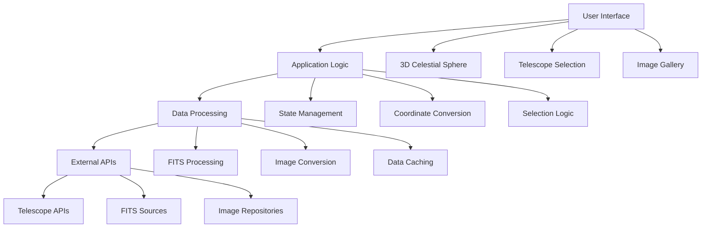
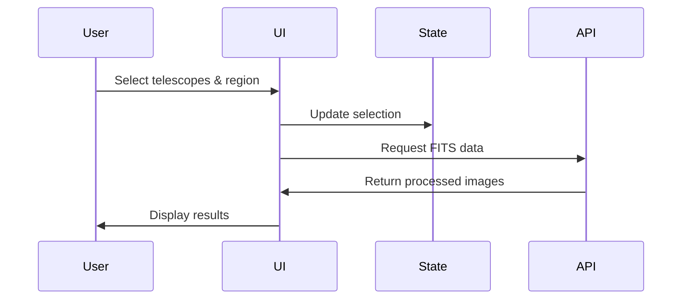
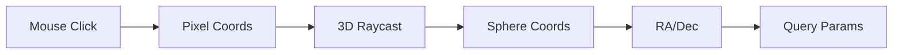
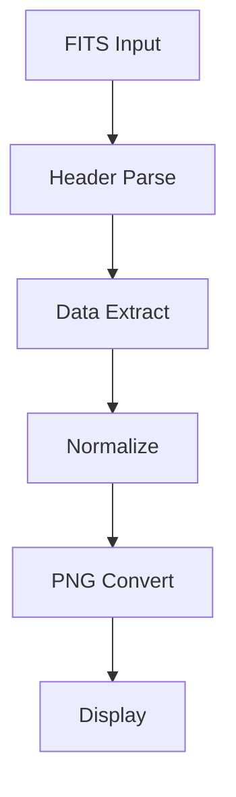

# Astronomical Image Viewer - System Architecture

## Overview

A sophisticated web application for interactive astronomical data exploration featuring 3D celestial sphere visualization, multi-telescope integration, and real-time coordinate processing.

## High-Level Architecture



## Core Components

### Frontend Stack
```
src/
├── components/
│   ├── CelestialSphere/          # 3D visualization
│   └── TelescopeCoverage.tsx     # Telescope coverage display
├── views/
│   └── AstroImageViewer/         # Main application
├── utils/
│   ├── axios.ts                  # HTTP client
│   └── coordinate-utils.ts       # RA/Dec conversions
└── types/                        # TypeScript definitions
```

**Technology Stack:**
- React 18 + TypeScript + Three.js
- Ant Design + SCSS Modules
- Zustand + Axios

### Data Flow



### Key Systems

#### 3D Visualization Engine
- **WebGL Rendering**: Hardware-accelerated 3D graphics
- **Raycasting**: Precise 3D mouse interaction
- **Camera Controls**: Constrained movement within celestial sphere
- **Coordinate Conversion**: Pixel → 3D → RA/Dec transformations

#### Telescope Integration
- **Supported Telescopes**: Euclid, WISE, DESI, 2MASS
- **Dynamic Filters**: Telescope-specific filter options
- **Unified Queries**: Coordinated multi-telescope data retrieval
- **Data Processing**: FITS → PNG conversion pipeline

#### Selection System
- **Interactive Selection**: Click/drag on 3D sphere
- **Coordinate Tracking**: Real-time RA/Dec display
- **Boundary Validation**: Ensure valid celestial regions
- **Multi-point Selection**: Rectangle corner coordinates

## Data Processing

### Coordinate Conversion Pipeline


### FITS Processing Pipeline


### External APIs
- **Euclid**: Filters [Y, J, H]
- **WISE**: Filters [W1, W2, W3, W4]
- **DESI**: Filters [Red, Blue, Near-infrared]
- **2MASS**: Filters [J, H, K]

## Performance & Optimization

### Rendering Optimizations
- **LOD System**: Dynamic sphere resolution based on zoom
- **Texture Streaming**: Progressive loading of celestial textures
- **Frustum Culling**: Render only visible sphere portions
- **Memory Management**: Proper Three.js resource cleanup

### Data Management
- **Lazy Loading**: On-demand FITS data retrieval
- **Smart Caching**: Local storage of converted images
- **Request Debouncing**: Prevent excessive API calls
- **Background Processing**: Web workers for FITS conversion

## User Interface

### Layout System
```
┌─────────────────────────────────────────────────────────────┐
│                 Astronomical Image Viewer                   │
├──────────────┬─────────────────────────────┬────────────────┤
│ Telescopes   │                             │  Coordinates   │
│  & Filters   │   3D Celestial Sphere       │  Selection     │
│              │   (Main Visualization)      │  [Retrieve]    │
│              │                             │────────────────│
│              │                             │  Retrieved     │
│              │                             │  Data          │
├──────────────┴─────────────────────────────┴────────────────┤
│                Retrieved Images Gallery                     │
└─────────────────────────────────────────────────────────────┘
```

### Responsive Design
- **Desktop**: Full three-panel layout with overlay zoom
- **Tablet**: Collapsible sidebars with touch controls
- **Mobile**: Vertical stack with bottom navigation

### Interaction Patterns
- **Selection Mode**: Crosshair cursor, drag-to-select
- **Navigation Mode**: Orbit controls for 3D manipulation
- **Zoom View**: Real-time magnification following cursor
- **Touch Support**: Gesture-based navigation for mobile

## Future Enhancements

### Planned Features
- **Multi-wavelength Composites**: Combine images from different filters
- **Time-series Analysis**: Temporal data visualization support
- **Catalog Overlays**: Star catalogs and galaxy cluster displays
- **Collaborative Features**: Shared selections and annotations

### Technical Improvements
- **WebGL2 Rendering**: Advanced shader-based processing
- **Web Workers**: Parallel FITS processing
- **WebAssembly**: High-performance coordinate transformations
- **PWA Support**: Offline data access capabilities

### Security & Privacy
- **API Authentication**: Secure telescope data access
- **Data Encryption**: Protected observational data
- **Access Control**: Role-based user permissions
- **Privacy Compliance**: Transparent data usage policies

---

*This architecture balances performance, usability, and extensibility while maintaining clean separation of concerns between visualization, data processing, and user interaction.*
